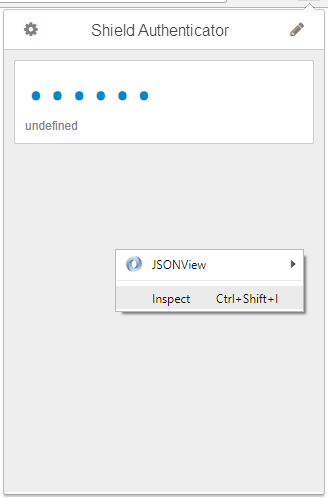
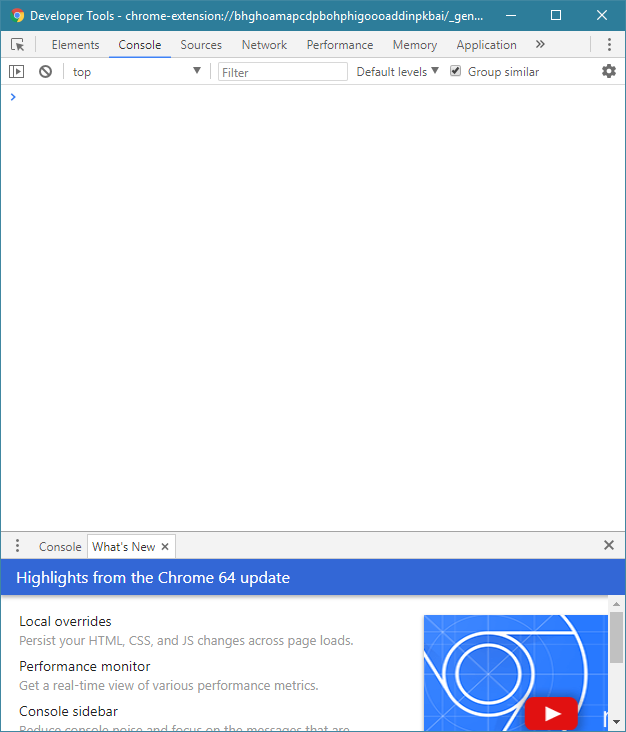
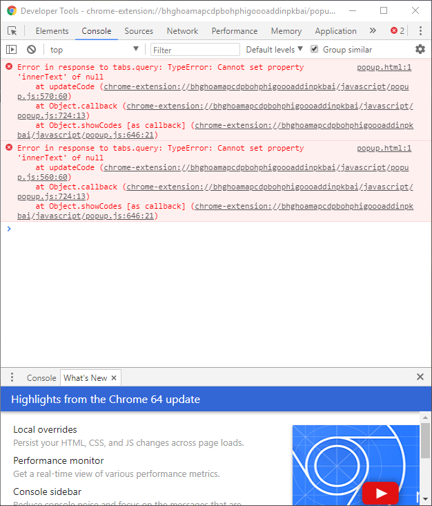
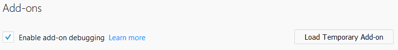
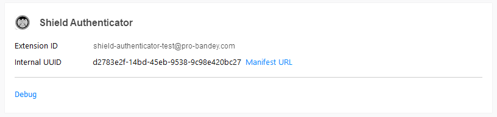
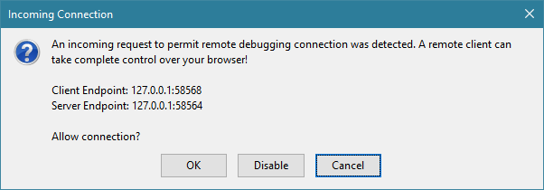
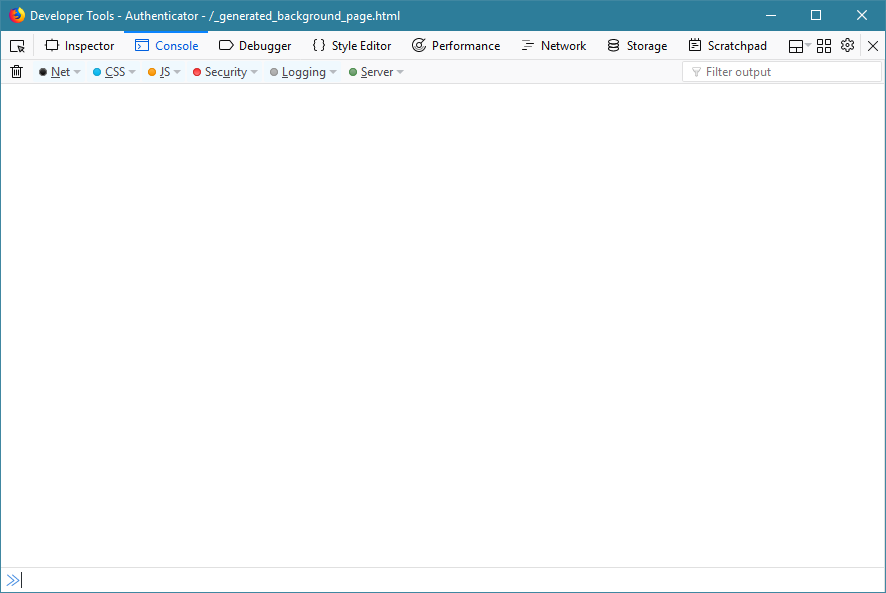
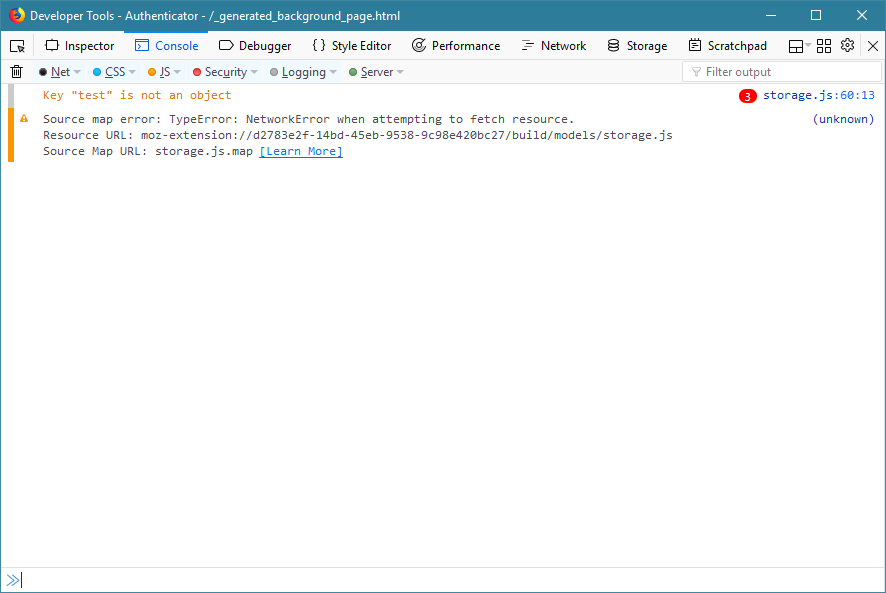

## Chrome

1. Open Authenticator
2. Right click Authenticator and click "Inspect"

3. Go to the "Console" tab

4. Copy and paste any messages into the issue description

---

## Firefox

1. Go to `about:debugging`
2. Check the box that says "Enable add-on debugging"

3. Click the link that says "Debug" under Authenticator 

4. Click "Ok"

5. Make sure that you are on the console tab

6. Open Authenticator again
7. Copy and paste any messages into the issue description

