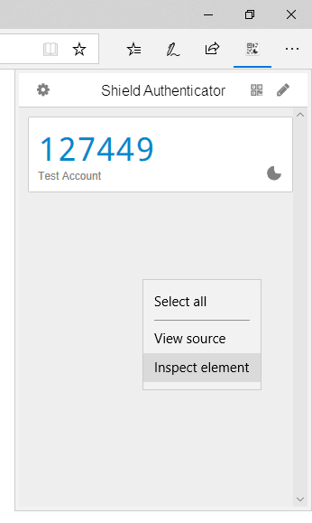
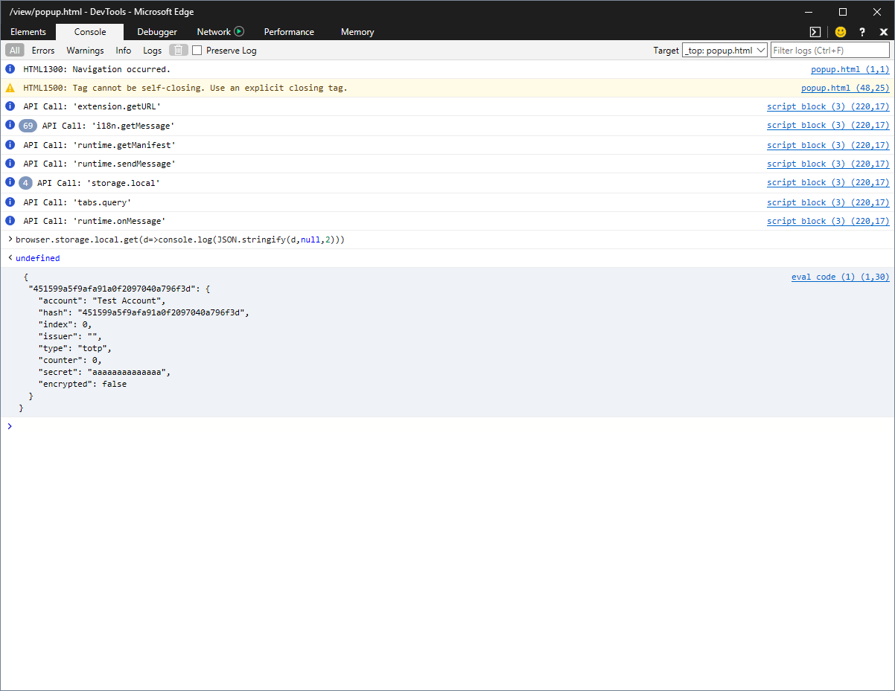
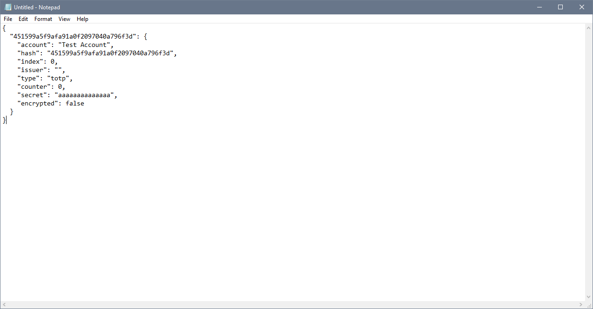
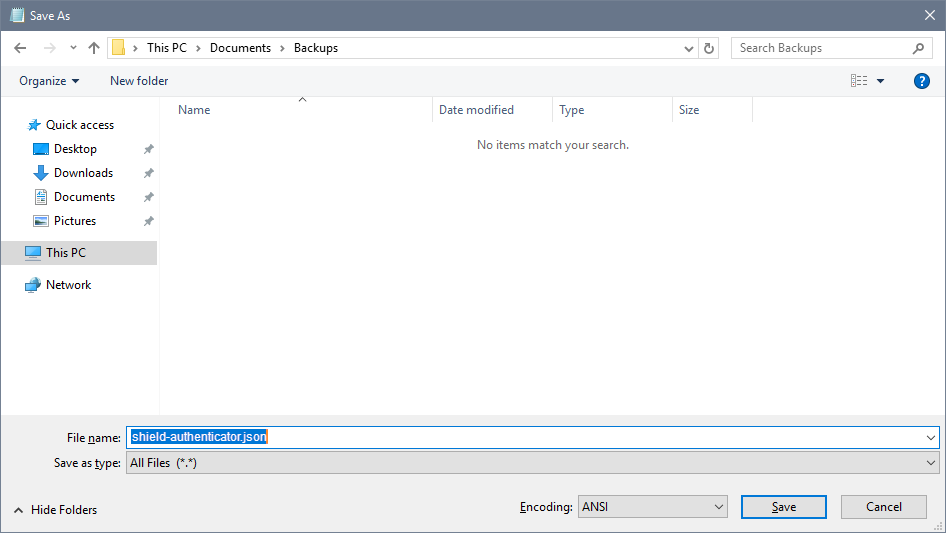

1. Open Authenticator, right click, and choose "Inspect Element"



2. Go to the "Console" tab at the top of the new window
3. Paste this into the console and hit enter
```javascript
browser.storage.local.get(d=>console.log(JSON.stringify(d,null,2)))
```



4. Copy the result to notepad



5. Save as a file ending in `.json`


