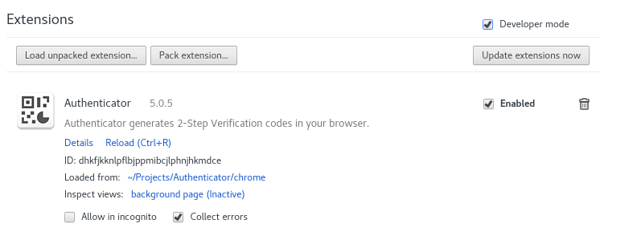
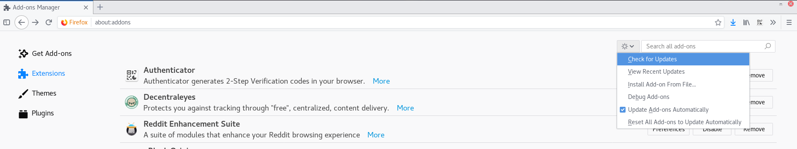

## Chrome

1. Go to `chrome://extensions`

2. Check the box labelled "Developer Mode" in the top right

3. Click "Update Extensions Now"

## Firefox

1. Go to `about:addons`

2. Click the gear at the top right

3. Click "Check for Updates"

